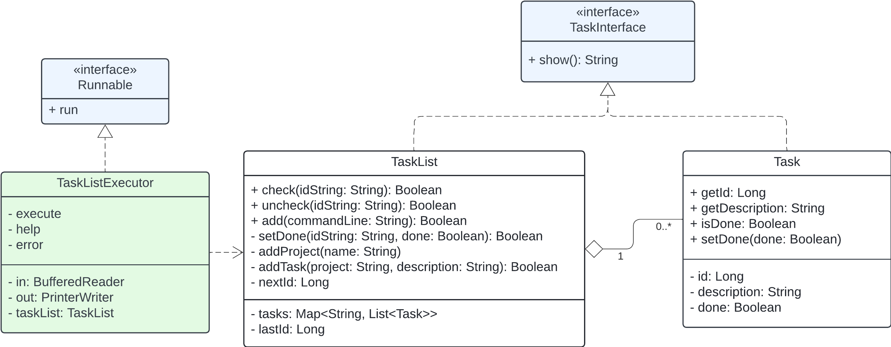
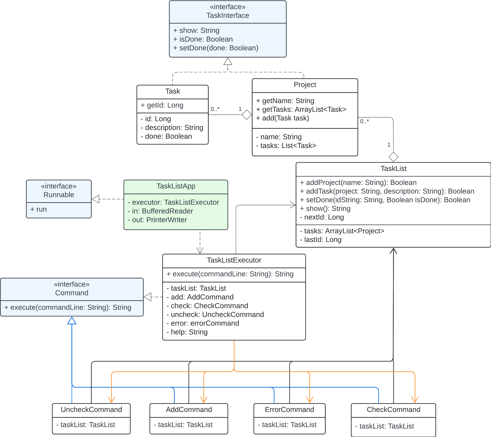

# Task-List-Kata
NTUT 112-2 Software Architecture Lesson

## HW2

### Class Diagrams
Refactored version 1: [] 
Refactored version 2: []

### Refactored parts
- Add command interface
  - Polymorphism
    - AddCommand
    - CheckCommand
    - UncheckCommand
    - ErrorCommand (though it's not a command)
- Separate TaskListApp and TaskListExecutor
  - TaskListApp:
    - depends on TaskListExecutor, BufferedReader, PrinterWriter
    - implements Runnable
  - TaskListExecutor:
    - implements CommandInterface
    - depends on other commands( add,check,uncheck,error)
    - all executions return String to TaskListApp
- TaskInterface is implemented by Task and Project
  - Task - the information for a task
  - Project - list of Task(s)
  - TaskList - list of Project(s)
